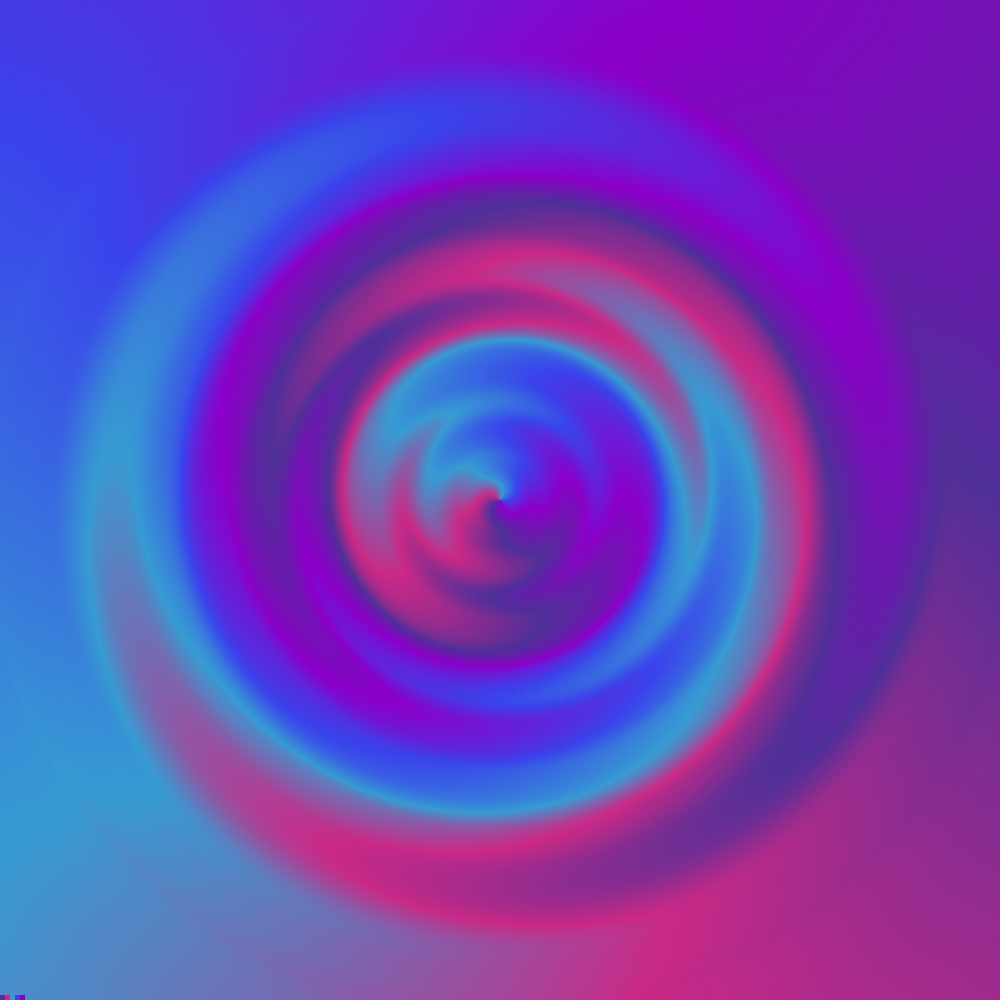
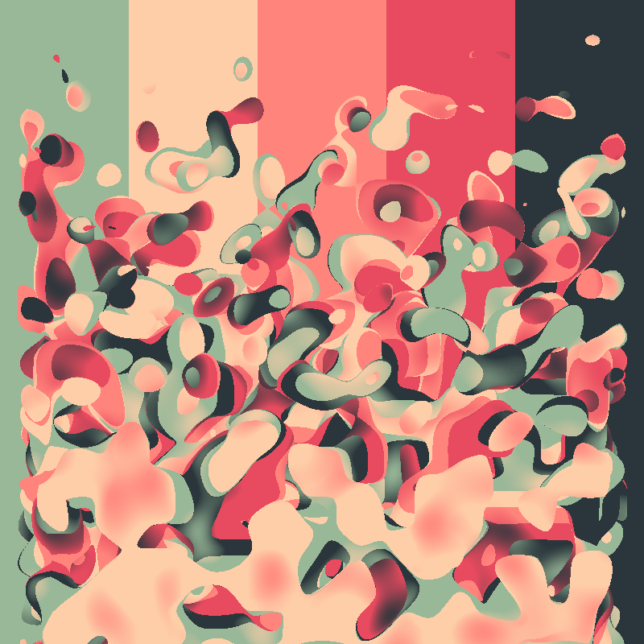
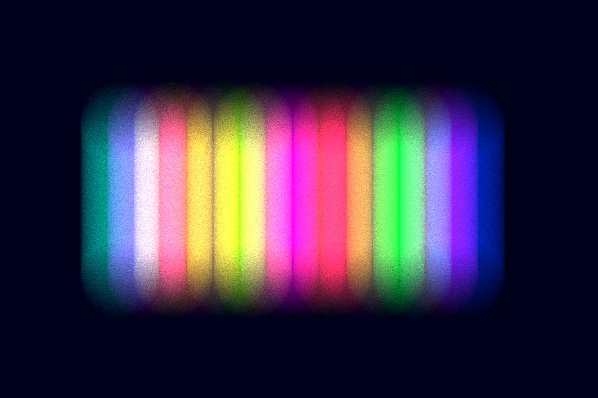
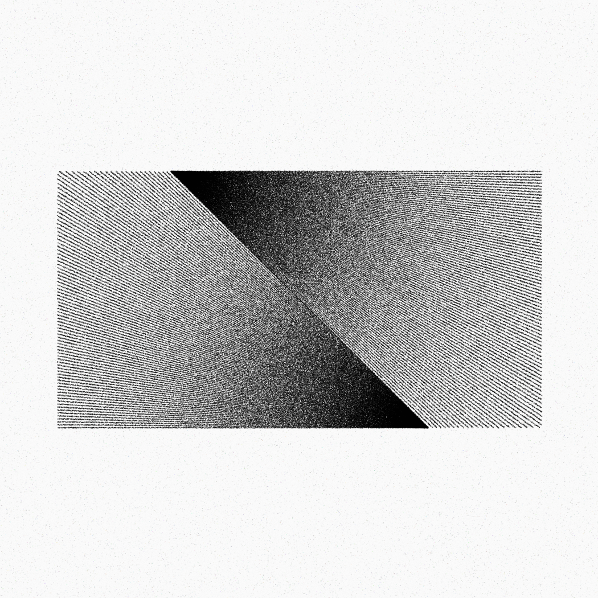
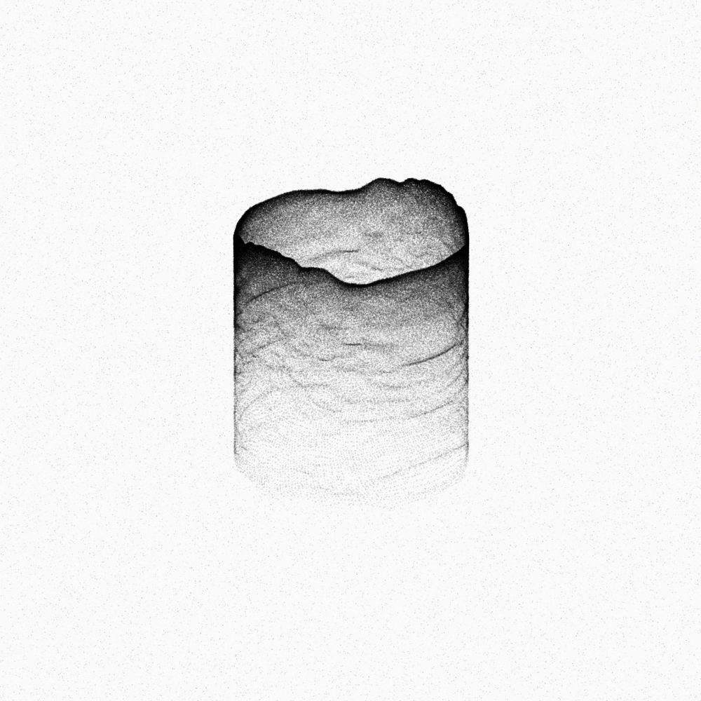

# Generative Art Collection

A repository of my Processing-based generative art projects.

## Repository Structure

- **common/** - Reusable utilities and libraries for generative art. For example:
  - Color utilities
  - Math functions
  - Particle systems
  - Vector operations
  
- **template/** - Starting point for new generative art projects
  - Basic setup with canvas configuration
  - Common imports
  - Parameter management
  - Image export utilities

- everything else is a generative art project

## Depencencies

- [Processing](https://processing.org/) - The programming environment and language used for generative art creation.
- [PaperAndPencil](https://github.com/SThor/PaperAndPencil) - A library that I've created for creating paper textures and pencil-like drawing effects. Used in a few projects (e.g., `pencil/` and `tube/`). See the readme in that repository for more details on how to install and use it.

## Getting Started

To create a new project:

1. Copy the `template/` folder
2. Rename it to your project name
3. Open the .pde file in Processing
4. Modify and experiment!

## Gallery

*Color Growth, 5 April 2025*

*Gaussian, 24 December 2022*

*Lines, 26 March 2022*

*Pencil, 16 February 2022*

*Tube, 26 March 2022*

## Social Media

Find more of my generative art at:

- Instagram: [@esstepaper](https://instagram.com/esstepaper)
- Pixelfed: [@silmathoron](https://pixelfed.fr/silmathoron)
- Reddit: [u/silmathoron](https://reddit.com/user/silmathoron)
